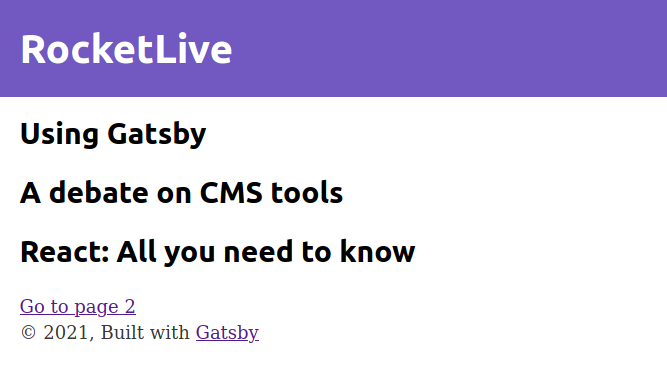
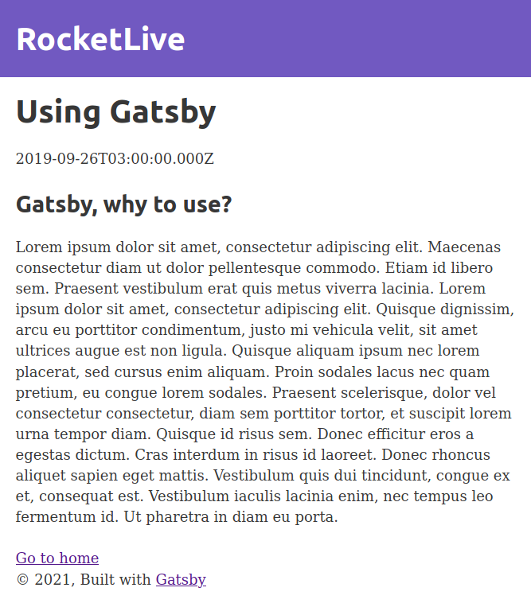

## GoStack Bootcamp Live 19

> 🚀 Practical project of the [Rocketseat](https://rocketseat.com.br) GoStack Bootcamp.  
👷 Developed by Matheus Ramalho de Oliveira.  
🔨 Systems Analyst, Full-Stack Developer.  
🏡 Goiânia, Goiás, Brasil.  
✉️ kastorcode@gmail.com  
👍 [instagram.com/kastorcode](https://www.instagram.com/kastorcode)

---

  

    Live 19: Gatsby

---

### Screenshots

  

  

---

### 🚀 Installation and execution

1. Make a clone of this repository;
2. Enter the folder running `cd gostack-live-19-gatsby`;
3. Run `yarn` to install dependencies;
4. Run `yarn start` to start the development server;
5. Open the address `http://localhost:8000` in the browser;
6. Use the secondary link `http://localhost:8000/___graphql` to make information query. [Know more](https://www.gatsbyjs.org/tutorial/part-five/#introducing-graphiql).

---

### 🧐 What has inside?

    ├── node_modules
    ├── content
    ├── src
    ├── .gitignore
    ├── .prettierrc
    ├── gatsby-browser.js
    ├── gatsby-config.js
    ├── gatsby-node.js
    ├── gatsby-ssr.js
    ├── package.json
    └── README.md
    └── yarn.lock

1. **`/node_modules`**: Contains all project dependencies;
2. **`/content`**: Does not come with the Gatsby, stores blog posts, created with Markdown;
3. **`/src`**: `Src` is a convention for `source code`, here is the code related to the frontend of the site;
4. **`.gitignore`**: Which files are ignored by GIT;
5. **`.prettierrc`**: [Prettier](https://prettier.io) settings;
6. **`gatsby-browser.js`**: Gatsby default [Browser API](https://www.gatsbyjs.org/docs/browser-apis) file;
7. **`gatsby-config.js`**: Main configuration file of a Gatsby website; [Know more](https://www.gatsbyjs.org/docs/gatsby-config);
8. **`gatsby-node.js`**: Gatsby default [Node API](https://www.gatsbyjs.org/docs/node-apis) file, we use to create the blog pages from the `content` folder;
9. **`gatsby-ssr.js`**: Gatsby default [Server-side rendering API](https://www.gatsbyjs.org/docs/ssr-apis) file;
10. **`package.json`**: Manifest file for Node.js projects;
11. **`yarn.lock`**: Automatically generated by Yarn.

---

### 🗓 ️Roadmap

- Introduction to Node.js
- Creating Node.js project
- Continuing Node.js project
- CSS Flexbox
- UI Design
- Introduction to React
- First project with ReactJS
- First project with React Native
- Front-end documentation
- Flux architecture
- Using React Hooks
- Server-side rendering(SSR) with ReactJS
- GraphQL
- Expo
- Creating ReactJS project
- Creating React Native project
- Animations with React Native
- Full-stack app development
- Node.js tests
- Node.js deploy
- ReactJS tests
- React Native tests
- ReactJS deploy
- React Native publication
- WebSocket with Express
- Advanced patterns at Node.js
- OmniStack SaaS(software as a service) and AdonisJS
- Final challenge
- Monorepo
